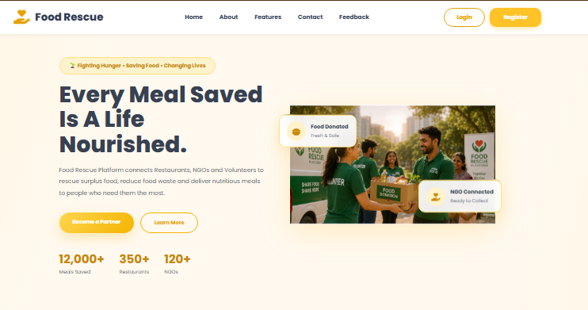
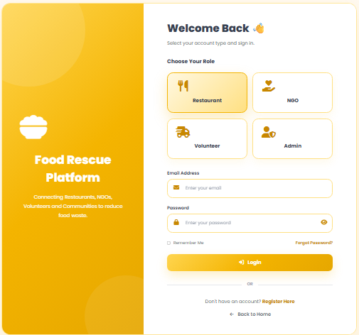
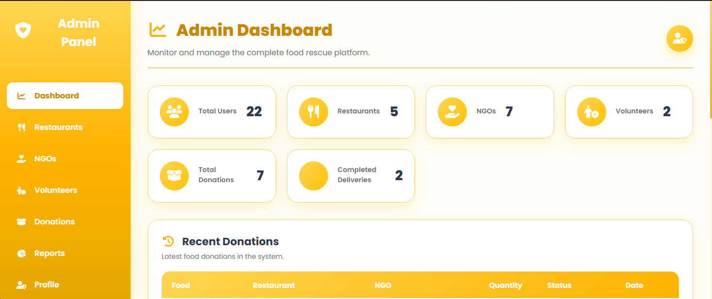
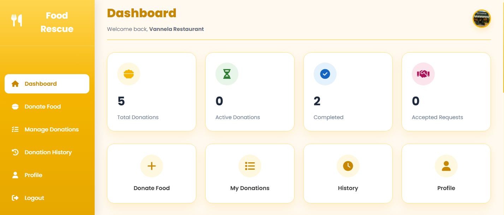
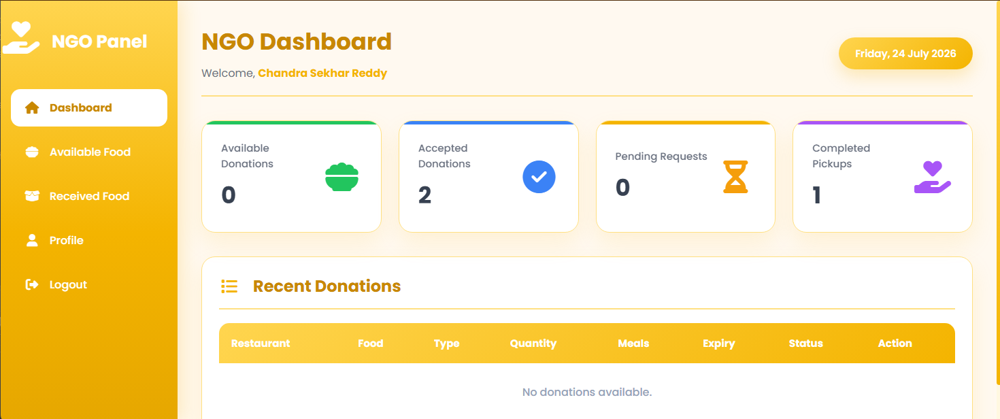
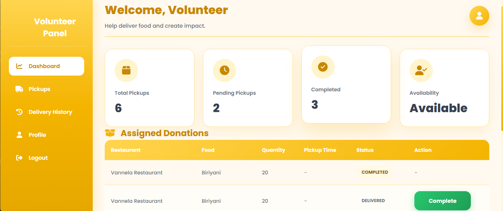

# 🍽️ Food Rescue Platform

A full-stack web application that helps reduce food wastage by connecting **Restaurants**, **NGOs**, **Volunteers**, and **Administrators** to efficiently redistribute surplus food to those in need.

---

## 📌 Project Overview

Food waste is a significant global issue while many people still face hunger every day. The Food Rescue Platform bridges this gap by enabling restaurants to donate excess food, NGOs to accept donations, volunteers to deliver them, and administrators to manage the entire workflow.

The platform provides a secure, role-based system with real-time donation management and tracking.

---

## ✨ Features

### 🌐 Public Module
- Home Page
- About Us
- Contact Us
- Feedback
- User Registration
- Secure Login

### 🍴 Restaurant Module
- Restaurant Registration
- Restaurant Profile Management
- Add Food Donations
- Update Donation Details
- Delete Donations
- View Donation History
- Track Donation Status

### 🤝 NGO Module
- NGO Registration
- NGO Profile Management
- View Available Donations
- Accept Donations
- View Accepted Donations
- Track Donation Progress

### 🚚 Volunteer Module
- Volunteer Registration
- Volunteer Profile Management
- View Assigned Donations
- Pick Up Donations
- Deliver Donations
- View Delivery History

### 👨‍💼 Admin Module
- Dashboard
- Manage Restaurants
- Manage NGOs
- Manage Volunteers
- Monitor Donations
- View Food Requests
- Manage Feedback
- Generate Reports

---

## 🔐 Authentication & Security

- JWT Authentication
- Spring Security
- BCrypt Password Encryption
- Role-Based Authorization
- Protected REST APIs

---

## ⚙️ Technology Stack

### Backend
- Java 21
- Spring Boot
- Spring Security
- JWT Authentication
- Spring Data JPA
- Maven

### Frontend
- React
- Vite
- React Router DOM
- Axios
- HTML5
- CSS3
- JavaScript

### Database
- MySQL

### Tools
- Git & GitHub
- Postman
- IntelliJ IDEA
- VS Code
- MySQL Workbench

---

## 🏗️ Project Architecture

```
React Frontend
       │
       ▼
Axios API Layer
       │
       ▼
Spring Boot REST API
       │
       ▼
Service Layer
       │
       ▼
Repository Layer
       │
       ▼
MySQL Database
```

---

## 📂 Backend Structure

```
backend
│
├── config
├── controller
├── dto
├── entity
├── enums
├── exception
├── repository
├── security
├── service
├── serviceimpl
└── util
```

---

## 📋 Database Tables

- users
- admins
- restaurants
- ngos
- volunteers
- donations
- food_requests
- feedback

---

## 🚀 Installation

### 1. Clone Repository

```bash
git clone https://github.com/ChandraSekharReddyVuturu/FoodRescuePlatform.git
cd FoodRescuePlatform
```

---

### 2. Backend Setup

```bash
cd backend
mvn clean install
mvn spring-boot:run
```

Backend runs on:

```
http://localhost:8080
```

---

### 3. Frontend Setup

```bash
cd frontend
npm install
npm run dev
```

Frontend runs on:

```
http://localhost:3000
```

---

### 4. Database

- Create a MySQL database.
- Import the provided SQL file.
- Update the database configuration in:

```
src/main/resources/application.properties
```

---

## 📷 Screenshots

### Home Page


### Login Page


### Admin Dashboard


### Restaurant Dashboard


### NGO Dashboard


### Volunteer Dashboard


---

## 📈 Future Enhancements

- Email Notifications
- Push Notifications
- Google Maps Integration
- Live Donation Tracking
- Mobile Application
- Analytics Dashboard
- AI-based Donation Prediction

---

## 👨‍💻 Team

**V. Chandra Sekhar Reddy** |

**V. Avinash** |

**G. Chandu** |

**M. Ajay** |

**P. Ravi Teja**

B.Tech – Computer Science and Engineering (Artificial Intelligence)

Madanapalle Institute of Technology and Science

---

## 📄 License

This project is developed for educational and academic purposes.
